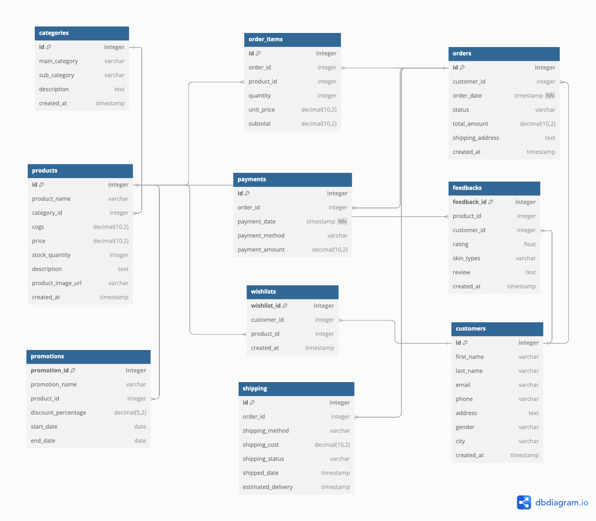

# Relational Database and Analytical Query

Project ini bertujuan untuk membangun sebuah sistem manajemen database yang memanfaatkan Relational Database guna menyimpan, mengelola, dan menganalisis data yang terstruktur. Dalam project ini, saya menggunakan database relasional untuk mengelola data yang terorganisir dalam tabel-tabel yang saling terkait, serta menerapkan Analytical Query untuk melakukan analisis mendalam terhadap data tersebut. Berikut adalah langkah-langkah dalam project ini:

## Mission Statement

Beautie merupakan website yang menyediakan beragam produk skincare dan makeup secara online. Beeautie dapat mempermudah pelanggan dalam memenuhi kebutuhan kecantikan mereka. Pelanggan dapat dengan mudah memilih produk skincare dan makeup yang diinginkan melalui website beautie. Setelah melakukan pemilihan, produk akan dikirimkan melalui jasa ekspedisi yang telah dipilih oleh pelanggan. Beautie memastikan setiap pesanan diproses dengan cepat dan dikirimkan dengan aman agar sampai tepat waktu di alamat tujuan.

## Table Structure and ERD

Berikut adalah deskripsi untuk struktur tabel yang akan dimasukkan ke database:

#### categories (Kategori Produk):
category_id: ID unik untuk setiap kategori (Primary Key).
main_category: Kategori utama produk.
sub_category: Sub-kategori dari kategori utama.
description: Deskripsi kategori.
created_at: Waktu pembuatan kategori, secara default diset ke waktu saat ini.

#### products (Produk):
product_id: ID unik untuk setiap produk (Primary Key).
product_name: Nama produk.
category_id: ID kategori dari tabel categories, menghubungkan produk ke kategorinya (Foreign Key).
cogs: Cost of Goods Sold (harga pokok penjualan) dari produk.
price: Harga jual produk.
stock_quantity: Jumlah stok produk yang tersedia.
description: Deskripsi produk.
product_image_url: URL gambar produk.
created_at: Waktu pembuatan produk.

#### customers (Pelanggan):
customer_id: ID unik untuk setiap pelanggan (Primary Key).
first_name: Nama depan pelanggan.
last_name: Nama belakang pelanggan.
email: Email pelanggan (unik).
phone: Nomor telepon pelanggan.
address: Alamat pelanggan.
gender: Jenis kelamin pelanggan.
city: Kota tempat tinggal pelanggan.
created_at: Waktu pembuatan akun pelanggan.

#### orders (Pesanan):
order_id: ID unik untuk setiap pesanan (Primary Key).
customer_id: ID pelanggan yang melakukan pesanan (Foreign Key).
order_date: Tanggal pesanan dilakukan, secara default diset ke waktu saat ini.
status: Status pesanan.
total_amount: Total nilai pesanan.
shipping_address: Alamat pengiriman pesanan.
created_at: Waktu pembuatan pesanan.

#### order_items (Detail Pesanan):
order_item_id: ID unik untuk setiap item pesanan (Primary Key).
order_id: ID pesanan terkait (Foreign Key).
product_id: ID produk yang dipesan (Foreign Key).
quantity: Jumlah produk yang dipesan.
unit_price: Harga satuan produk saat pemesanan.
subtotal: Total harga untuk item pesanan (quantity × unit_price).

#### payments (Pembayaran):
payment_id: ID unik untuk setiap pembayaran (Primary Key).
order_id: ID pesanan terkait (Foreign Key).
payment_date: Tanggal pembayaran dilakukan.
payment_method: Metode pembayaran yang digunakan pelanggan.
payment_amount: Jumlah yang dibayarkan, sesuai dengan total_amount pesanan.

#### shipping (Pengiriman):
shipping_id: ID unik untuk setiap pengiriman (Primary Key).
order_id: ID pesanan yang dikirim (Foreign Key).
shipping_method: Metode pengiriman yang digunakan pelanggan.
shipping_cost: Biaya pengiriman yang dibayar pelanggan.
shipping_status: Status pengiriman.
shipped_date: Tanggal pengiriman dilakukan.
estimated_delivery: Estimasi tanggal barang diterima.

#### feedbacks (Ulasan):
feedback_id: ID unik untuk setiap ulasan (Primary Key).
product_id: ID produk yang diulas (Foreign Key).
customer_id: ID pelanggan yang memberikan ulasan (Foreign Key).
rating: Nilai rating produk.
skin_types: Jenis kulit pelanggan.
review: Komentar atau ulasan pelanggan.
created_at: Waktu ulasan dibuat.

#### carts (Keranjang Belanja):
cart_id: ID unik untuk setiap keranjang belanja (Primary Key).
customer_id: ID pelanggan yang memiliki keranjang (Foreign Key).
product_id: ID produk yang ditambahkan ke keranjang (Foreign Key).
quantity_cart: Jumlah produk dalam keranjang.
created_at: Waktu produk ditambahkan ke keranjang.

#### wishlists (Daftar Keinginan):
wishlist_id: ID unik untuk setiap wishlist (Primary Key).
customer_id: ID pelanggan yang membuat wishlist (Foreign Key).
product_id: ID produk dalam wishlist (Foreign Key).
created_at: Waktu produk ditambahkan ke wishlist.

#### promotions (Promosi):
promotion_id: ID unik untuk setiap promosi (Primary Key).
promotion_name: Nama promosi.
product_id: ID produk yang dipromosikan (Foreign Key).
discount_percentage: Persentase diskon yang diberikan.
start_date: Tanggal mulai promosi.
end_date: Tanggal akhir promosi.

## Relasi antar table:

*One-to-Many:* categories → products, customers → orders, orders → order_items, products → feedbacks, products → order_items.
*One-to-One:* orders → payments, orders → shipping.
*Many-to-Many* customers → products via carts dan wishlists.

## ERD




## Dummy data using Faker

Membuat data palsu dengan faker yang akan digunakan untuk mengisi database.

### 1. Inisialisasi Faker

```bash
pip install faker
 ```
```python
from faker import Faker

faker = Faker()
 ```

 ### 2. Membuat File `.env` dan menghubungkannya ke PgAdmin

-**Contoh isi file `.env`:**

```plaintext
DB_USERNAME: `your_username`
DB_PASSWORD: `your_password`
DB_HOST: `localhost`
DB_PORT: `5432`
DB_NAME: `your_database_name`
```

**Inisialisasi dotenv:**

```bash
pip install python-dotenv
```
```python
from dotenv import load_dotenv

load_dotenv()
```
**Menghubungkan ke PgAdmin:**

```pyhton
conn = psycopg2.connect(
        host=os.getenv('DB_HOST'),
        database=os.getenv('DB_NAME'),
        user=os.getenv('DB_USER'),
        password=os.getenv('DB_PASSWORD'),
        port=os.getenv('DB_PORT'))
```


## 3. Membuat dummy data 

### Contoh membuat dummy data menggunakan Faker:

```python
name = faker.name()
phone = faker.phone_number()[:10]
address = faker.address()
city = faker.city()
  ```

## Analytical Query

### Sales Analysis
- **Total Revenue, Total Cost, dan Total Profit**: Menghitung jumlah penjualan bulanan dengan melakukan JOIN antara tabel orders dan products, lalu menghitung total revenue dari penjualan, total cost, dan total profit. Menggunakan EXTRACT untuk mengambil bulan dari kolom order_date sehingga data dapat diurutkan berdasarkan bulan penjualan.

- **Total Penjualan Berdasarkan Promosi**:  Menghitung total penjualan berdasarkan produk yang mendapatkan promosi dengan menggabungkan tabel promotions dan products, dan tabel order_items untuk mendapatkan total penjualan yang dipengaruhi oleh promosi dapat dihitung.

- **Total Penjualan Sebelum dan Sesudah Diskon**:  Menghitung total penjualan sebelum dan sesudah diskon dengan melakukan JOIN antara tabel promotions, products, dan orders. Total diskon dihitung berdasarkan penjualan kemudian dihitung total sebelum dan sesudah diskon.

### Product Analysis

- **Produk Terlaris Setiap Bulannya**: Menghitung total penjualan per produk untuk setiap bulan dengan melakukan JOIN antara tabel orders dan order_items untuk mendapatkan data penjualan, serta tabel products untuk mengambil nama produk. Dengan RANK(), produk diurutkan berdasarkan total penjualan di setiap bulan.

- **5 Produk Tertinggi dan Terendah Berdasarkan Total Sales**: Menghitung total penjualan untuk masing-masing produk dengan menggunakan JOIN antara tabel product untuk mengambil data produk dan tabel order_items untuk mengambil total penjualan. Produk diurutkan berdasarkan total penjualan dan diambil 5 produk dengan total penjualan tertinggi serta terendah.

- **5 Produk dengan Rata-Rata Rating Tertinggi dan Terendah**:  Menghitung rata-rata rating untuk masing-masing produk dengan menggunakan JOIN antara tabel feedbacks untuk mengambil data rating dan tabel products untuk mengambil nama produk. Produk diurutkan berdasarkan rata-rata rating dan diambil 5 produk dengan rating tertinggi serta terendah.

- **10 Produk Paling Banyak di Wishlist**: Menampilkan 10 produk yang paling sering ditambahkan ke wishlist oleh pelanggan dengan menggunakan JOIN antara tabel wishlist dan products untuk menghitung frekuensi produk ditambahkan ke wishlist. Produk  diurutkan berdasarkan jumlah wishlist dan diambil 10 produk dengan frekuensi tertinggi.

- **10 Produk Paling Banyak di Masukkan Keranjang**: Menampilkan 10 produk yang paling banyak di masukkan keranjang oleh pelanggan dengan menggunakan JOIN antara tabel carts dan products untuk menghitung frekuensi produk ditambahkan ke cart. Produk diurutkan berdasarkan quantity cart dan diambil 10 produk dengan frekuensi tertinggi.

### Customer Analysis

- **Frekuensi Pembelian Customer**: Menghitung berapa kali setiap pelanggan melakukan transaksi dengan menggabungkan tabel customers dan orders. Data transaksi per pelanggan dihitung, dan hasilnya menampilkan pelanggan diurutkan berdasarkan jumlah pembelian mereka.

- **Customer yang Menyimpan Wishlist**: Mengambil daftar pelanggan yang telah menambahkan produk ke wishlist dengan menggabungkan tabel wishlist dan customers. Pelanggan yang memiliki wishlist diurutkan berdasarkan jumlah produk yang mereka tambahkan.

- **Customer yang Memasukan Produk ke Keranjang**: Mengambil daftar pelanggan yang telah menambahkan produk ke keranjang dengan menggabungkan tabel carts dan customers. Pelanggan yang memasukkan produk ke keranjang diurutkan berdasarkan jumlah produk yang mereka masukkan.

- **Customer Tidak Melakukan Pembelian**: Mengambil daftar pelanggan yang belum pernah melakukan transaksi dengan menggabungkan tabel customers dan orders. Pelanggan yang tidak pernah membeli diurutkan berdasarkan transaksi.

- **Total Customer Berdasarkan Gender**: Menghitung jumlah pelanggan berdasarkan gender dengan mengambil data dari tabel customers. Pelanggan diurutkan berdasarkan kategori gender.

- **Customer dengan Pembelian Kurang dari 3x**: Mengambil daftar pelanggan yang hanya melakukan pembelian kurang dari 3 kali dalam satu tahun dengan menghitung jumlah transaksi mereka, lalu pelanggan diurutkan berdasarkan frekuensi pembeliannya.

- **Metode Shipping Terbanyak**:  Menganalisis metode pengiriman yang paling sering digunakan dengan mengambil data dari tabel orders. Metode pengiriman diurutkan berdasarkan seberapa sering digunakan pelanggan.

- **Metode Pembayaran Terbanyak**: Menganalisis metode pembayaran yang paling sering digunakan dengan mengambil data dari tabel orders. Metode pembayaran diurutkan berdasarkan seberapa sering digunakan pelanggan.

- **Shipping Status**: Menyajikan status pengiriman untuk setiap pesanan dengan mengambil data dari tabel orders. Status pengiriman diurutkan berdasarkan jumlah pesanan yang sesuai dengan setiap status tersebut.

For more Explanation in [Medium](https://medium.com/@zhrzalfaa/create-relational-database-and-analytical-query-7b1d7e791f62)

Until next time!